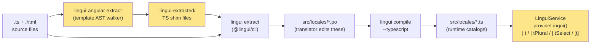

# @tocdk/lingui-angular

[](https://github.com/tocDK/lingui-angular/actions/workflows/ci.yml)
[](https://github.com/tocDK/lingui-angular/releases)
[](LICENSE)
[](https://angular.dev/)

Angular 20+ bindings for [Lingui](https://lingui.dev/) — write English in source, extract via AST, ship PO catalogs. Signal-only, zoneless, standalone-first.

---

## Contents

1. [Status & roadmap](#status--roadmap)
2. [What & why](#what--why)
3. [How it works](#how-it-works)
4. [Install](#install)
5. [60-second quickstart](#60-second-quickstart)
6. [Templates](#templates)
7. [Plural & select](#plural--select)
8. [Extraction setup](#extraction-setup)
9. [SSR](#ssr)
10. [Troubleshooting & FAQ](#troubleshooting--faq)
11. [Reference](#reference)
12. [Kitchen-sink reference](#kitchen-sink-reference)
13. [Comparison](#comparison)
14. [Contributing](#contributing)
15. [License](#license)

---

## Status & roadmap

**Current version: `v0.1.0`** — first usable cut. Distributed via github-install only (not on npm).

> **Pre-1.0.** The public API may evolve based on dogfooding feedback. Breaking changes will land on minor version bumps until `v1.0.0`. Use `npm i github:tocDK/lingui-angular#v0.1.0` to pin.

### Roadmap

| Version | Scope |
|---|---|
| `v0.1.0` (released) | Runtime, extractor, kitchen-sink demo, CI, MIT license |
| `v0.2.0` (planned) | GitHub Pages deployment of the kitchen-sink, HTML-comment extraction (`<!-- i18n: ... -->`), Playwright e2e against the demo |
| `v1.0.0` (criteria) | First external user OR 4 weeks of dogfooding without API change; npm publish as `@tocdk/lingui-angular` becomes an option |

Open an issue if you have a use-case that isn't covered.

---

## What & why

`@tocdk/lingui-angular` lets you write all your user-facing strings as plain English directly in source (no message-ID keys to maintain), extract them at build time by walking Angular template ASTs, and ship the results as standard PO catalogs that any translator tool can edit. At runtime the library is a thin Signal-aware wrapper around `@lingui/core` — locale changes propagate reactively without Zone.js, and SSR catalog handoff is handled for you via Angular `TransferState`.

---

## How it works

`@tocdk/lingui-angular` glues two systems together: Angular's template AST (for finding strings in `.html`) and Lingui's mature extraction/catalog pipeline (for everything downstream of finding them).



- **Yellow boxes** are this library's contribution; the rest is Lingui as-is.
- The shim files are throwaway: they live in `.lingui-extracted/` (gitignored), get consumed by Lingui's CLI, then `lingui-angular clean` deletes them.
- The PO file is the source of truth that translators edit (in Poedit, Crowdin, Weblate, etc.). Everything downstream regenerates from it.
- At runtime, only the compiled `.ts` catalogs ship — no PO parsing in the browser.

---

## Install

> **Requires Node ≥ 22** (declared in `engines` — Angular 20 and ng-packagr 20 pull this floor).

```bash
npm install github:tocDK/lingui-angular
```

When installed as a dependency (the common case), npm fetches the repo's pre-built `dist/` artifact — the `prepare` script's guard skips rebuild because the `projects/` source tree is not packed in the published `files`. Cloning the repo for local development DOES trigger `prepare` (since `projects/` is present), which builds the library (~30 s first time).

**Peer dependencies** — install these yourself:

```bash
npm install @angular/core @angular/common @lingui/core
# For the extractor (dev only):
npm install --save-dev @angular/compiler @lingui/cli @lingui/format-po
```

---

## 60-second quickstart

### 1. Bootstrap with `provideLingui`

```typescript
// main.ts
import { bootstrapApplication } from '@angular/platform-browser';
import { provideZonelessChangeDetection } from '@angular/core';
import { provideRouter } from '@angular/router';
import { provideLingui } from '@tocdk/lingui-angular';
import { AppComponent } from './app/app.component';
import { routes } from './app/app.routes';

bootstrapApplication(AppComponent, {
  providers: [
    provideZonelessChangeDetection(),
    provideRouter(routes),
    provideLingui({
      sourceLocale: 'en',
      locales: ['en', 'fr', 'da', 'es'],
      loader: async (locale) => {
        // Import pre-compiled .ts catalogs (run `lingui compile --typescript` first)
        switch (locale) {
          case 'fr': return import('./locales/fr');
          case 'da': return import('./locales/da');
          case 'es': return import('./locales/es');
          default:   return import('./locales/en');
        }
      },
    }),
  ],
});
```

### 2. Add a locale switcher

```typescript
// locale-switcher.component.ts
import { Component, inject } from '@angular/core';
import { LinguiService } from '@tocdk/lingui-angular';

@Component({
  selector: 'app-locale-switcher',
  standalone: true,
  template: `
    @for (l of lingui.locales; track l) {
      <button (click)="lingui.activate(l)" [disabled]="lingui.locale() === l">{{ l }}</button>
    }
  `,
})
export class LocaleSwitcherComponent {
  protected readonly lingui = inject(LinguiService);
}
```

### 3. Translate in a component

```typescript
// greeting.component.ts
import { Component, computed, inject } from '@angular/core';
import { LinguiService, TPipe, TDirective } from '@tocdk/lingui-angular';

@Component({
  selector: 'app-greeting',
  standalone: true,
  imports: [TPipe, TDirective],
  template: `
    <h1>{{ greeting() }}</h1>
    <h2>{{ 'Welcome' | t }}</h2>
    <button [t]="'Sign in'"></button>
  `,
})
export class GreetingComponent {
  private readonly lingui = inject(LinguiService);
  protected greeting = computed(() => this.lingui.t('Hello'));
}
```

---

## Templates

### `| t` pipe — plain string

```html
<p>{{ 'Hello' | t }}</p>
```

### `| t` pipe — with interpolation

```html
<!-- Single placeholder -->
<p>{{ 'Hello, {name}' | t: { name: name() } }}</p>

<!-- $context is an extraction hint (verb vs. noun disambiguation); stripped at runtime -->
<button>{{ 'File' | t: { $context: 'verb' } }}</button>

<!-- $id overrides the message key (useful for long messages with a short ID) -->
<p>{{ 'Very long source string...' | t: { $id: 'long-msg' } }}</p>
```

### `[t]` directive — set `textContent`

```html
<span [t]="'About'"></span>
<button [t]="label()"></button>
```

The directive uses an Angular `effect()` internally so it re-runs reactively whenever the locale changes or the bound value changes.

### `LinguiService.t()` — one-shot translation in TypeScript

```typescript
const msg = this.lingui.t('Hello');
```

### `LinguiService.t$()` — reactive Signal translation

```typescript
// Re-evaluates automatically when locale changes
protected label = this.lingui.t$('Submit');
```

---

## Plural & select

### `| tPlural` — locale-aware plural rules

```html
<p>{{ count() | tPlural: { one: '# item', other: '# items' } }}</p>
```

`#` is replaced with the count. Supported keys: `zero`, `one`, `two`, `few`, `many`, `other` (CLDR rules).

### `| tSelect` — enumerated values

```html
<p>{{ status() | tSelect: { active: 'Online', away: 'Idle', other: 'Offline' } }}</p>
```

The `other` key is required as the fallback.

---

## Extraction setup

### 1. Configure Lingui

```typescript
// lingui.config.ts
import { defineConfig } from '@lingui/cli';
import { formatter } from '@lingui/format-po';

export default defineConfig({
  locales: ['en', 'fr', 'da', 'es'],
  sourceLocale: 'en',
  format: formatter({ lineNumbers: false }),
  catalogs: [
    {
      path: '<rootDir>/src/locales/{locale}',
      include: [
        '<rootDir>/src/**/*.ts',
        '<rootDir>/.lingui-extracted/**/*.ts',   // ← shims from the Angular extractor
      ],
    },
  ],
});
```

### 2. Run extraction

```bash
npm run extract
```

Under the hood this runs:

```bash
lingui-angular extract   # walks Angular templates, writes shims to .lingui-extracted/
lingui extract           # Lingui CLI picks up shims + .ts sources, updates .po files
lingui-angular clean     # removes the shim directory
```

Wire this up in `package.json`:

```json
{
  "scripts": {
    "extract": "lingui-angular extract && lingui extract && lingui-angular clean",
    "extract:check": "lingui compile --typescript && git diff --exit-code projects/your-app/src/locales"
  }
}
```

> **`extract:check` scope.** This guard catches drift between committed `.po` files and the generated `.ts` modules (translator edited the `.po` but forgot to recompile). It does **not** catch the case where a developer adds a new translatable string to source and forgets to run `npm run extract` first. The fuller cycle requires the extractor to also walk inline templates declared in component decorators, which is tracked for v0.2 — at present the walker only processes standalone `.html` files. Until then, run `npm run extract` manually before every commit that touches translatable strings.

### 3. Compile catalogs

Before building the app, compile PO files to TypeScript modules:

```bash
npx lingui compile --typescript
```

Then import them with a dynamic `switch` in your `loader` (see the quickstart above). Angular CLI's esbuild pipeline does not support `.po` imports natively.

### 4. Watch mode

```bash
lingui-angular extract --watch & lingui extract --watch
```

### Extractor CLI reference

```
lingui-angular extract [--watch]   Extract templates → .lingui-extracted/
lingui-angular clean               Remove .lingui-extracted/
```

---

## SSR

`LinguiService` automatically reads from Angular `TransferState` on the client — no FOUC (flash of untranslated content).

### Server bootstrap

```typescript
// main.server.ts
import { bootstrapApplication } from '@angular/platform-browser';
import { provideServerRendering } from '@angular/ssr';
import { provideZonelessChangeDetection } from '@angular/core';
import { provideLingui } from '@tocdk/lingui-angular';
import { AppComponent } from './app/app.component';
import { routes } from './app/app.routes';

const bootstrap = () =>
  bootstrapApplication(AppComponent, {
    providers: [
      provideZonelessChangeDetection(),
      provideServerRendering(),
      provideLingui({ /* same config as client */ }),
    ],
  });

export default bootstrap;
```

### Serializing the catalog on the server

Call `serializeCatalog` inside your request handler or an `APP_INITIALIZER` that runs on the server:

```typescript
import { inject, TransferState } from '@angular/core';
import { LinguiService, serializeCatalog } from '@tocdk/lingui-angular';

// In an APP_INITIALIZER or route resolver:
const lingui = inject(LinguiService);
const state  = inject(TransferState);
serializeCatalog(lingui.i18n, state, 'lingui-catalog');
```

The client-side `LinguiService` constructor automatically calls `hydrateCatalog` and skips the network fetch when the payload is present.

---

## Troubleshooting & FAQ

### Why won't my `.po` files import directly?

Angular CLI's esbuild bundler does not recognize `.po` files. You have two options:
1. **Pre-compile at build time** (recommended): run `npx lingui compile --typescript` before `ng build` and have your loader `import('./locales/<locale>')` resolve to the generated `.ts` modules. Wire it into `prebuild` in `package.json` for safety.
2. **Use a custom Webpack/esbuild loader**: write a small plugin to transform `.po` into JSON at build time. More flexible but more code to maintain.

### `t is not a function` at runtime when I use `import { t } from '@tocdk/lingui-angular'`

The `t` tagged-template-literal export was intentionally removed — `@lingui/core/macro` is a Babel-time transform that esbuild (Angular CLI's bundler) cannot execute. Use one of:
- `LinguiService.t('Hello')` — one-shot string translation
- `LinguiService.t$('Hello')` — reactive `Signal<string>`
- `{{ 'Hello' | t }}` in templates (the pipe form)

### `npm install github:tocDK/lingui-angular` is slow

First install runs `prepare` which builds the library (~30 s — ng-packagr + extractor compile). Subsequent installs that reuse a cached `node_modules` are instant. CI installs are slower because of cold cache.

### Missing translations don't fall back

`@lingui/core` returns the source string when a key isn't in the catalog (this is built-in Lingui behavior, not something we override). Check the browser console — Lingui logs a warning for each missing key once. If you're seeing the *key* literal instead of the source string, double-check your loader returned `{ messages }` with the right shape.

### Two apps in one bundle — do they share locale state?

No. `LinguiService` is scoped to the environment injector that `provideLingui()` was called in. Each `EnvironmentInjector` (including each micro-frontend) gets its own service instance with its own active locale. There's a regression test for this in `provide-lingui.spec.ts`.

### How do I add a new locale?

1. Add the locale code to `locales: [...]` in `provideLingui()` config
2. Add the locale code to `locales: [...]` in `lingui.config.ts`
3. Run `npm run extract` — Lingui creates an empty `.po` for the new locale
4. Translate the strings
5. Run `npx lingui compile --typescript` to regenerate `.ts` modules
6. Update your loader's `switch` to import the new locale

### How do I add a translator comment for context?

For templates: use `{{ 'Open' | t: { $context: 'verb' } }}` — `$context` is extraction-only and gets baked into the PO as `msgctxt`. For TypeScript, use `LinguiService.t({ message: 'Open', context: 'verb' })` (note: at runtime `context` is currently ignored — extraction-only — but the catalog will key-with-context correctly).

HTML comments like `<!-- i18n: explanation -->` are **not extracted** in v0.1 — Angular 20's `parseTemplate()` strips comments before producing the AST. Tracked as a v0.2 follow-up.

---

## Reference

### Public exports

| Export | Kind | Signature | Notes |
|---|---|---|---|
| `provideLingui` | function | `(config: LinguiConfig) => EnvironmentProviders` | Bootstrap helper for `bootstrapApplication`. |
| `LinguiConfig` | type | `{ sourceLocale, locales, loader, fallbackLocales?, detectLocale?, ssrTransferKey? }` | See full shape below. |
| `LinguiCatalog` | type | `{ messages: Messages }` | What `loader()` must resolve to. |
| `LinguiService` | class | injectable | Active-locale state machine. |
| `LinguiUnknownLocaleError` | class | `extends Error` with `.locale: string` | Thrown by `activate()` for unknown locales (after fallbacks). |
| `LINGUI_CONFIG` | `InjectionToken<LinguiConfig>` | — | Rarely needed directly. |
| `TPipe` | pipe | `\| t: { ...values, $context?, $id? }` | Reactive, impure. |
| `TPluralPipe` | pipe | `\| tPlural: rules` | CLDR plural forms with `#` substitution. |
| `TSelectPipe` | pipe | `\| tSelect: rules` | Match-by-key with required `other`. |
| `TDirective` | directive | `[t]="literal \| signal()"` | Sets element `textContent`. Re-runs on locale OR binding change. |
| `serializeCatalog` | function | `(i18n, state, key) => void` | Server-side TransferState write. |
| `hydrateCatalog` | function | `(i18n, state, key) => boolean` | Client-side TransferState read. |
| `DEFAULT_SSR_TRANSFER_KEY` | constant | `'lingui-catalog'` | Default `TransferState` key. |
| `LINGUI_SSR_KEY` | `InjectionToken<string>` | — | Override the TransferState key per app. |
| `LinguiTransferPayload` | type | `{ locale: string; messages: Record<string, string> }` | Wire format between server and client. |

### `LinguiService` surface

| Member | Type | Purpose |
|---|---|---|
| `locale` | `Signal<string>` | Currently active locale code. |
| `loading` | `Signal<boolean>` | True while a catalog is loading. |
| `sourceLocale` | `string` | The locale your source strings are in. |
| `locales` | `readonly string[]` | All configured locales. |
| `i18n` | `I18n` (from @lingui/core) | Escape hatch for power users. |
| `activate(locale)` | `Promise<void>` | Loads catalog (cached) and switches active. Throws `LinguiUnknownLocaleError` for unknown locales after fallbacks. |
| `t(descriptor)` | `string` | One-shot translation. |
| `t$(descriptor)` | `Signal<string>` | Reactive translation; re-emits on locale change. |

### `LinguiConfig` full shape

```typescript
interface LinguiConfig {
  sourceLocale: string;                       // 'en'
  locales: string[];                          // ['en', 'fr', 'da', 'es']
  loader: (locale: string) => Promise<LinguiCatalog>;
  fallbackLocales?: Record<string, string> & { default?: string };  // { 'fr-CA': 'fr', default: 'en' }
  detectLocale?: () => string | null;         // default: undefined (uses sourceLocale)
  ssrTransferKey?: string;                    // default: 'lingui-catalog'
}
```

### Extractor CLI

| Command | Effect |
|---|---|
| `lingui-angular extract` | Walks `.html` templates, writes shims to `.lingui-extracted/` |
| `lingui-angular extract --watch` | As above, but re-runs on filesystem changes (chokidar) |
| `lingui-angular clean` | Removes `.lingui-extracted/` |

### Reserved keys in `| t` options map

| Key | Meaning |
|---|---|
| `$context` | `msgctxt` — disambiguation hint baked into the PO key. Extraction-only. |
| `$id` | Override the message key. Use when the source string is ambiguous (e.g. "Welcome" appears in 3 different contexts). |
| any other key | Placeholder name — its value is interpolated into `{name}`-style slots. |

---

## Kitchen-sink reference

The [`projects/kitchen-sink/`](projects/kitchen-sink/) directory in this repo contains a full Angular SSR application covering every documented API:

| Route | Feature |
|---|---|
| `/basic` | `LinguiService.t()`, `| t` pipe, `[t]` directive |
| `/params` | `| t` with placeholders |
| `/plural` | `| tPlural` |
| `/select` | `| tSelect` |
| `/context` | `$context` extraction hint |
| `/explicit-id` | `$id` key override |
| `/lazy` | Lazily loaded route with its own catalog |
| `/ssr` | SSR `TransferState` handoff |
| `/cd` | Change-detection stress test |
| `/missing` | Missing-key fallback behaviour |

Run it locally:

```bash
npm start         # dev server — http://localhost:4200
npm run build:lib && npm run build:demo:ssr && node dist/kitchen-sink/server/server.mjs
```

A hosted GitHub Pages deployment is planned for v0.2.

---

## Comparison

| | `@tocdk/lingui-angular` | `ngx-translate` | `@angular/localize` |
|---|---|---|---|
| **Write strings as English** | Yes — extract from source | Message-ID keys | Message-ID keys |
| **Signal / zoneless** | Native | Observable-based | Compile-time only |
| **PO catalog format** | Yes | JSON (plugin for PO) | XLIFF |
| **Template extraction** | Angular AST walker | No | `ng extract-i18n` |
| **SSR hydration** | Built-in `TransferState` | Manual | Built-in |
| **Install** | `github:tocDK/lingui-angular` | npm | npm (Angular core) |

---

## Contributing

See [CONTRIBUTING.md](CONTRIBUTING.md).

---

## License

MIT — see [LICENSE](LICENSE).
